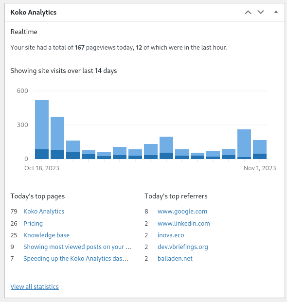

# Modify dashboard widget

Koko Analytics provides various filter hooks to modify the default behavior of the dashboard widget.

The default dashboard widget shows like this:



To show more than 5 items in the list of top pages and referrers:

```php
add_filter('koko_analytics_dashboard_widget_number_of_top_items', function() { return 10; });
```

You can set it to `0` to hide that part entirely:

```php
add_filter('koko_analytics_dashboard_widget_number_of_top_items', function() { return 0; });
```
